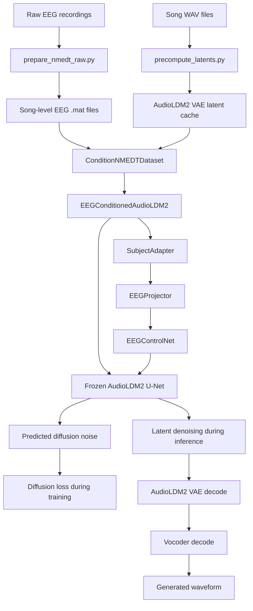
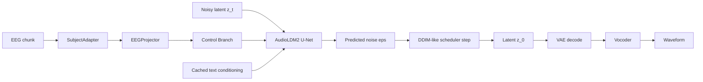

# REPO_OVERVIEW

## 1. Project Overview

This repository implements an EEG-to-music generation pipeline built around a pretrained `AudioLDM2-music` diffusion backbone. The repo is explicitly inspired by *Naturalistic Music Decoding from EEG Data via Latent Diffusion Models* and adapts that idea into a configurable experimentation framework.

At a high level, the system:

1. Loads song-level EEG recordings and aligned audio clips.
2. Converts audio into AudioLDM2 VAE latents.
3. Projects EEG into the same latent grid used by the audio diffusion model.
4. Uses a ControlNet-style branch to inject EEG-conditioned residuals into a frozen pretrained AudioLDM2 U-Net.
5. Trains the model to predict diffusion noise in latent space.
6. At inference time, starts from noise and generates audio latents conditioned on EEG, then decodes them back to waveform.

The intended problem is not waveform regression from EEG. Instead, the repo tries to use EEG as a conditioning signal for a pretrained latent diffusion music generator.

### End-to-end summary

The current code path is:

`raw EEG -> song-level processed EEG -> chunked EEG -> EEG projector / Control branch -> AudioLDM2 latent denoising -> VAE decode to mel -> vocoder decode to waveform`

## 2. System Architecture

### High-level architecture

### Data flow by stage

### Module interaction

- `datasets/condition_nmedt_dataset.py` prepares aligned `(EEG chunk, audio chunk, subject_idx, z0)` samples.
- `models/eeg_conditioned_audioldm2.py` is the top-level training/inference model.
- `models/subject_adapter.py` optionally applies subject-specific affine modulation to EEG.
- `models/eeg_projector.py` maps EEG `[B, C, T]` to latent grid `[B, C_latent, H, W]`.
- `models/eeg_controlnet.py` is a copied/modified ControlNet-like branch built from the pretrained U-Net encoder and middle block.
- `models/audioldm_unet_wrapper.py` wraps the pretrained AudioLDM2 U-Net and text conditioning.
- `models/audioldm2_wrapper.py` wraps AudioLDM2 VAE encode/decode and CLAP-audio feature extraction.
- `utils/generation.py` performs latent generation and waveform decoding support.

## 3. Data Pipeline

### 3.1 Data sources

#### EEG

The repo supports two conceptual EEG formats:

1. Raw NMED-T participant recordings such as `02_1_raw.mat`
2. Song-level `.mat` files expected by the training code, shaped as `[channels, time, subjects]`

The training dataset consumes the second form.

Relevant code:

- `scripts/prepare_nmedt_raw.py`
- `datasets/condition_nmedt_dataset.py`
- `datasets/nmedt_dataset.py`

Expected song-level EEG format:

- MATLAB `.mat`
- key per song such as `data22`
- tensor shape `[channels, time, subjects]`

#### Audio

Per-song `.wav` files are expected, e.g. `data/songs/song22_16k.wav`.

Expected audio format in the current config:

- mono waveform
- `16 kHz`
- chunked into `3.5` second windows

#### Current configured song set

From [configs/train.yaml](/home/bryan/eeg/configs/train.yaml), the current training config uses:

- `song22` to `song30` for training/validation/testing
- `song21` is excluded from `data.songs`

This is consistent with treating `song21` as an OOD track outside the main training set.

### 3.2 Preprocessing

#### EEG preprocessing

There are two relevant preprocessing layers in the repo:

1. Raw-recording conversion preprocessing in `scripts/prepare_nmedt_raw.py`
2. Dataset-side preprocessing in `datasets/eeg_preprocessing.py`

Current relevant functions:

- `scripts/prepare_nmedt_raw.py`
  - `_robust_scale`
  - `_center_using_first_samples`
  - `_std_clamp`
  - `_downsample_linear`
- `datasets/eeg_preprocessing.py`
  - `apply_source_level_eeg_preprocessing`
  - `apply_chunk_level_eeg_preprocessing`

Implemented EEG preprocessing options include:

- removing face channels by keeping the first `124` channels
- robust scaling by median / IQR
- centering using the mean over the first `1000` samples
- clamping by a multiple of per-channel standard deviation
- optional chunk-level per-channel normalization

The current training code passes `normalize_eeg=False` and `eeg_preprocessing=None` when building the dataset in [train.py](/home/bryan/eeg/scripts/train.py), so train-time EEG preprocessing is intentionally disabled for the processed-data path.

#### Audio preprocessing

Audio is not converted to mel externally. Instead, `models/audioldm2_wrapper.py` defines the audio-to-latent path:

- `waveform_to_mel`
- `encode_mel`
- `forward`

Important current details from `AudioLDM2MusicEncoderWrapper`:

- uses `torchaudio.transforms.MelSpectrogram`
- current mel config defaults:
  - `n_fft=1024`
  - `win_length=1024`
  - `hop_length=160`
  - `n_mels=64`
  - `norm="slaney"`
  - `mel_scale="slaney"`
- converts mel magnitude to `log-mel` via:
  - `torch.log(torch.clamp(mel, min=self.mel_log_eps))`

This wrapper then encodes the mel with the AudioLDM2 VAE and scales the latent by `vae.config.scaling_factor`.

### 3.3 Data split

#### Current split behavior

The current config and code implement:

- subject split control in `utils/loso.py`
- chunk-range split control in `datasets/condition_nmedt_dataset.py`

Current config:

- `split.loso.enabled: false`
- `split.chunk_splits`
  - `train: [0.0, 0.8]`
  - `val: [0.8, 0.9]`
  - `test: [0.9, 1.0]`

Current code path:

- [train.py](/home/bryan/eeg/scripts/train.py) passes `chunk_split_name="train" | "val" | "test"` into `build_dataloader`
- [generate.py](/home/bryan/eeg/scripts/generate.py) also passes `args.split` into `build_dataloader`
- [condition_nmedt_dataset.py](/home/bryan/eeg/datasets/condition_nmedt_dataset.py) computes each `SongRecord.chunk_offset` and `SongRecord.n_chunks` from the configured chunk fraction

#### Important nuance

When `split.loso.enabled: false`, [train.py](/home/bryan/eeg/scripts/train.py) uses:

- all subjects for training
- first 10% of subjects for validation
- all subjects for test

This means:

- temporal chunk separation exists
- subject separation does not

So the current setup is closer to a temporal split than to LOSO.

#### Data leakage risk

Potential leakage risk remains because validation/test subjects overlap with train subjects when `loso.enabled` is disabled.

This is not hidden; it follows directly from [train.py](/home/bryan/eeg/scripts/train.py):

- `train_subjects: all_subjects`
- `val_subjects: all_subjects[: ... ]`
- `test_subjects: all_subjects`

Whether this matches the intended paper protocol cannot be concluded solely from the code. The code clearly does **not** enforce subject-disjoint train/val/test when `loso.enabled` is `false`.

## 4. Model Architecture

### 4.1 `EEGConditionedAudioLDM2`

File:

- [models/eeg_conditioned_audioldm2.py](/home/bryan/eeg/models/eeg_conditioned_audioldm2.py)

Purpose:

- top-level model used for training and inference
- combines EEG conditioning, AudioLDM2 U-Net denoising, and diffusion loss

Inputs:

- `eeg`: `[B, C, T]`
- `subject_idx`
- either `audio` waveform or precomputed latent `z0`
- diffusion `timesteps`

Outputs:

- training:
  - `loss`
  - `z0`
  - `zt`
  - `noise`
  - `eps_pred`
- inference helper path through `predict_noise`

Source classification:

- custom model orchestration
- built from both external pretrained modules and repo-defined modules

### 4.2 `SubjectAdapter`

File:

- [models/subject_adapter.py](/home/bryan/eeg/models/subject_adapter.py)

Purpose:

- subject-specific affine modulation of EEG

Behavior:

- embeds `subject_idx`
- predicts a per-channel scale and shift
- returns `eeg * (1 + scale) + shift`

Source classification:

- fully custom

### 4.3 `EEGProjector`

File:

- [models/eeg_projector.py](/home/bryan/eeg/models/eeg_projector.py)

Purpose:

- maps EEG time series into the latent grid expected by the diffusion model

High-level structure:

- stacked `Conv1d + GroupNorm + SiLU`
- `1x1 Conv1d` channel projection
- optional linear fallback if temporal length does not exactly match the target latent grid

Input:

- EEG `[B, C, T]`

Output:

- latent-shaped tensor `[B, C_latent, H, W]`

Source classification:

- fully custom

### 4.4 `EEGControlNet`

File:

- [models/eeg_controlnet.py](/home/bryan/eeg/models/eeg_controlnet.py)

Purpose:

- ControlNet-style conditioning branch
- produces residual features to inject into the pretrained U-Net encoder and optionally middle block

High-level structure:

- deep copies:
  - `conv_in`
  - `down_blocks`
  - `mid_block`
  - `time_proj`
  - `time_embedding`
  from the pretrained AudioLDM2 U-Net wrapper
- zero-initialized `1x1` convolutions for residual injection sites

Inputs:

- noisy latent `zt`
- projected EEG latent
- timesteps
- text conditioning

Outputs:

- `down_block_residuals`
- `mid_block_residual`

Source classification:

- modified/custom ControlNet-style module
- built from copied pretrained components plus custom zero-conv injection

### 4.5 `AudioLDMUNetWrapper`

File:

- [models/audioldm_unet_wrapper.py](/home/bryan/eeg/models/audioldm_unet_wrapper.py)

Purpose:

- wraps the pretrained AudioLDM2 U-Net
- caches prompt conditioning
- exposes U-Net internals for ControlNet-style conditioning

External source:

- `diffusers.AudioLDM2Pipeline`

What is external:

- pretrained `pipe.unet`
- prompt encoding through `pipe.encode_prompt`

What is modified/custom:

- caching prompt embeddings to disk / memory
- exposing copied control modules and inferred residual channels
- wrapper forward path that accepts optional `control_residuals`

Source classification:

- modified wrapper around official pretrained components

### 4.6 `AudioLDM2MusicEncoderWrapper`

File:

- [models/audioldm2_wrapper.py](/home/bryan/eeg/models/audioldm2_wrapper.py)

Purpose:

- VAE encode/decode wrapper for AudioLDM2
- waveform feature conversion
- CLAP-style audio similarity helper using AudioLDM2 text encoder audio features

External source:

- `diffusers.AudioLDM2Pipeline`

What is external:

- `pipe.vae`
- `pipe.mel_spectrogram_to_waveform`
- feature extractor / text encoder path used in `get_audio_features`

What is modified/custom:

- custom `waveform_to_mel`
- custom `encode_mel`
- custom `decode_latents_to_mel`

Source classification:

- modified wrapper around official pretrained components

### 4.7 CLAP / audio similarity path

This repo does not instantiate a standalone external CLAP package directly in the evaluation scripts. Instead, `AudioLDM2MusicEncoderWrapper.get_audio_features()` uses:

- `pipe.feature_extractor`
- `pipe.text_encoder.get_audio_features`

This is an AudioLDM2-provided audio embedding path.

From code alone, this is the similarity mechanism used for:

- validation CLAP-like score in training
- `scripts/evaluate_generation.py`

## 5. Code Structure

### `configs/`

- [configs/train.yaml](/home/bryan/eeg/configs/train.yaml)
  - central experiment, data, model, controlnet, latent cache, diffusion, split, and train settings

### `datasets/`

- [datasets/condition_nmedt_dataset.py](/home/bryan/eeg/datasets/condition_nmedt_dataset.py)
  - condition-aware dataset used by training and generation
- [datasets/nmedt_dataset.py](/home/bryan/eeg/datasets/nmedt_dataset.py)
  - simpler dataset used mainly for latent precompute
- [datasets/eeg_preprocessing.py](/home/bryan/eeg/datasets/eeg_preprocessing.py)
  - EEG preprocessing helpers

### `models/`

- [models/eeg_conditioned_audioldm2.py](/home/bryan/eeg/models/eeg_conditioned_audioldm2.py)
  - top-level train/inference model
- [models/eeg_projector.py](/home/bryan/eeg/models/eeg_projector.py)
  - EEG-to-latent projection
- [models/subject_adapter.py](/home/bryan/eeg/models/subject_adapter.py)
  - subject-specific modulation
- [models/eeg_controlnet.py](/home/bryan/eeg/models/eeg_controlnet.py)
  - ControlNet branch
- [models/audioldm_unet_wrapper.py](/home/bryan/eeg/models/audioldm_unet_wrapper.py)
  - pretrained AudioLDM2 U-Net wrapper
- [models/audioldm2_wrapper.py](/home/bryan/eeg/models/audioldm2_wrapper.py)
  - VAE/audio helper wrapper

### `scripts/`

- [scripts/train.py](/home/bryan/eeg/scripts/train.py)
  - main training entrypoint
- [scripts/generate.py](/home/bryan/eeg/scripts/generate.py)
  - generation entrypoint
- [scripts/precompute_latents.py](/home/bryan/eeg/scripts/precompute_latents.py)
  - precompute song chunk latents
- [scripts/evaluate_generation.py](/home/bryan/eeg/scripts/evaluate_generation.py)
  - CLAP-like evaluation over generated vs target audio
- [scripts/prepare_nmedt_raw.py](/home/bryan/eeg/scripts/prepare_nmedt_raw.py)
  - raw NMED-T inspection and conversion
- [scripts/compare_unet_to_official.py](/home/bryan/eeg/scripts/compare_unet_to_official.py)
  - diagnostic comparison between official and wrapped U-Net behavior

### `utils/`

- [utils/generation.py](/home/bryan/eeg/utils/generation.py)
  - generation loop, scheduler handling, waveform save helpers
- [utils/loso.py](/home/bryan/eeg/utils/loso.py)
  - LOSO subject split creation
- [utils/seed.py](/home/bryan/eeg/utils/seed.py)
  - reproducibility helper

### `tests/`

- [tests/test_generation_pipeline.py](/home/bryan/eeg/tests/test_generation_pipeline.py)
- [tests/test_paper_alignment_smoke.py](/home/bryan/eeg/tests/test_paper_alignment_smoke.py)
- [tests/test_train_validation_metric.py](/home/bryan/eeg/tests/test_train_validation_metric.py)

These provide smoke/regression coverage, not a full scientific validation suite.

## 6. Training Pipeline

### Entrypoint

- [scripts/train.py](/home/bryan/eeg/scripts/train.py)

### Training loop

The core training loop in `run_one_condition()` does:

1. Build train/val/test datasets and loaders.
2. Build `EEGConditionedAudioLDM2`.
3. Freeze parameters according to `controlnet` config via `apply_freeze_policy()`.
4. For each batch:
   - load `eeg`, `subject_idx`, and either `z0` or `audio`
   - sample timesteps
   - call `model(...)`
   - compute MSE loss between predicted and true diffusion noise
   - backpropagate and optimize
5. After each epoch:
   - compute `val_loss`
   - optionally compute generation-based `val_clap` via `evaluate_generation_clap()`
6. Save best checkpoint according to `train.validation_metric`

### Loss

Defined in [models/eeg_conditioned_audioldm2.py](/home/bryan/eeg/models/eeg_conditioned_audioldm2.py):

- `loss = F.mse_loss(eps_pred.float(), noise.float())`

This is standard latent diffusion noise-prediction training.

### Validation

When `train.validation_metric: clap`, validation does:

1. generate audio latents with `utils/generation.generate_latents()`
2. decode to waveform via `AudioLDM2MusicEncoderWrapper.decode_latents_to_waveform()`
3. compute audio embedding cosine similarity with `batch_clap_similarity()`

### Config influence

Important config blocks that directly affect training:

- `data`
  - songs, chunk length, sample rates, batch size, text prompt
- `latent_cache`
  - whether to use precomputed `z0`
- `model`
  - subject adapter, projector channels/strides, text cache
- `controlnet`
  - whether ControlNet is enabled
  - which modules are trainable
  - residual injection settings
- `train`
  - optimizer LR, epochs, validation metric, validation generation steps
- `split`
  - LOSO toggle and chunk ranges

## 7. Inference / Generation Pipeline

### Entrypoint

- [scripts/generate.py](/home/bryan/eeg/scripts/generate.py)

### Generation flow

1. Load config and resolve split.
2. Build dataset and loader.
3. Load `EEGConditionedAudioLDM2` checkpoint.
4. Build `AudioLDM2MusicEncoderWrapper` for decoding.
5. For each batch:
   - optionally replace EEG with zero/random depending on `--eeg-mode`
   - call `generate_latents(...)`
   - decode latents to waveform
   - save generated and target `.wav`
   - write `manifest.json`

### `generate_latents()`

Defined in [utils/generation.py](/home/bryan/eeg/utils/generation.py).

Important current behavior:

- uses the scheduler cloned from the cached AudioLDM2 pipeline
- for `use_control=False`, calls `_generate_latents_official_backbone()`
  - this uses the official pretrained AudioLDM2 U-Net backbone with prompt conditioning
- for `use_control=True`, runs the repo’s EEG-aware denoising loop
  - uses official-style latent preparation
  - uses CFG-style text conditioning
  - calls `model.predict_noise(...)`

### Decoder path

Latents are decoded by:

1. `AudioLDM2MusicEncoderWrapper.decode_latents_to_mel()`
2. `pipe.mel_spectrogram_to_waveform()`

The wrapper transposes latent spatial axes before VAE decode:

- this is an explicit implementation detail in `decode_latents_to_mel()`

## 8. External Dependencies

### Core libraries

From [requirements.txt](/home/bryan/eeg/requirements.txt), the main runtime dependencies include:

- `torch`
- `torchaudio`
- `diffusers`
- `transformers`
- `huggingface_hub`
- `scipy`
- `soundfile`
- `librosa`
- `h5py`
- `PyYAML`
- `pytest`

### Pretrained models / external assets

The primary pretrained model used in current code is:

- `cvssp/audioldm2-music`

Loaded through:

- `diffusers.AudioLDM2Pipeline`

The repo also reuses pipeline-owned components:

- U-Net
- VAE
- scheduler
- prompt encoder path
- mel-to-waveform decoder path

## 9. Important Observations

This section is grounded in the current code, not in intended behavior alone.

### 9.1 The repo is a hybrid of official AudioLDM2 components and custom conditioning code

This is not a thin wrapper around an official end-to-end EEG model.

The system combines:

- official pretrained AudioLDM2 modules
- custom EEG preprocessing and raw conversion
- custom EEG projector
- custom subject adapter
- custom ControlNet-style branch
- custom latent generation loop for the control-enabled path

This means debugging quality issues requires checking both:

- pretrained component alignment
- custom conditioning path correctness

### 9.2 Split behavior is highly config-dependent

The codebase can behave very differently depending on:

- `split.loso.enabled`
- `split.chunk_splits`
- `data.songs`

At the time of this analysis, the active config:

- excludes `song21` from train songs
- disables LOSO
- uses temporal chunk splits

If another config re-enables LOSO or reintroduces `song21`, the evaluation regime changes materially.

### 9.3 Validation/test subject overlap exists in the current non-LOSO config

This is one of the clearest caveats in the current setup.

When `loso.enabled: false`, `train.py` uses all subjects for training and test, and only the first subset for validation. This creates overlap between train/test subjects.

This is not hidden in code; it is the current behavior.

### 9.4 `use_control=False` and `use_control=True` do not share exactly the same generation path

In [utils/generation.py](/home/bryan/eeg/utils/generation.py):

- `use_control=False` uses `_generate_latents_official_backbone()`
- `use_control=True` uses `model.predict_noise(...)`

So `no_control` is not a pure ablation of the exact same denoising implementation. It is a useful comparison, but it is not a perfect same-path control.

### 9.5 Audio latent quality depends heavily on the wrapper implementation

The repo uses a custom `waveform_to_mel()` before VAE encoding. This is a sensitive part of the system because:

- training uses precomputed latents derived from this path
- generation quality depends on compatibility between encode and decode behavior

The current implementation uses a custom `log-mel` path. Whether this exactly matches the original AudioLDM2 training preprocessing cannot be determined from this repo alone.

Recommended wording from code evidence:

- the current implementation is a custom approximation built to work with the AudioLDM2 VAE
- exact equivalence to original AudioLDM2 music training preprocessing is not established by this codebase

### 9.6 The repo assumes prompt-conditioned generation even though the target task is EEG-to-music

Text conditioning is always present through `data.text_prompt`, currently defaulting to `"Pop music"`.

This means the actual task implemented in code is closer to:

- `text + EEG -> music`

than to:

- `EEG only -> music`

That is an important design assumption.

### 9.7 The latent cache must be rebuilt whenever the audio-to-latent definition changes

Because `scripts/precompute_latents.py` stores VAE latents to disk, any change to:

- mel extraction
- VAE wrapper settings
- song set
- chunking assumptions

requires regenerating the latent cache.

The current code does not automatically rebuild a missing or stale cache during training.

### 9.8 Potential reasons for poor results

Based on the current code, plausible failure modes include:

- EEG conditioning is too weak or ignored
  - because `real`, `zero`, and `random` may become too similar
- control-enabled generation path diverges from the official pretrained path
- custom audio-to-latent preprocessing may not perfectly match the pretrained model’s expected distribution
- subject overlap in non-LOSO mode may inflate some metrics while not improving perceptual quality
- `no_control` and `real_control` are not an apples-to-apples same-path comparison

These are code-grounded engineering risks, not speculative literature claims.

### 9.9 The raw conversion script is explicit but assumption-heavy

`scripts/prepare_nmedt_raw.py` makes several strong assumptions:

- mapping raw subject IDs to clean subject IDs
- trigger-driven song slicing using `DIN_1`
- fixed song durations per trigger
- keeping the first 124 channels

These choices are visible in code and useful, but exact equivalence to the dataset authors’ original preprocessing is not guaranteed by this repo alone.

## 10. Overall Data Flow Summary

The repo first converts raw participant EEG into per-song tensors, then chunks those tensors and aligned per-song audio into fixed 3.5-second windows. Audio chunks are encoded into AudioLDM2 VAE latents and cached. During training, EEG chunks are optionally modulated by subject identity, projected into latent space, and used through a ControlNet-style branch to condition a frozen pretrained AudioLDM2 U-Net on diffusion noise prediction. During inference, the model starts from Gaussian noise, denoises latents under EEG conditioning, and decodes the resulting latents back into waveform using the AudioLDM2 VAE and vocoder.

## 11. Model Relationship Summary

- `SubjectAdapter` modifies EEG based on subject identity.
- `EEGProjector` converts EEG from `[B, C, T]` into latent-grid tensors.
- `EEGControlNet` transforms projected EEG into residuals aligned with the AudioLDM2 U-Net encoder/middle block.
- `AudioLDMUNetWrapper` hosts the pretrained denoiser and text conditioning.
- `EEGConditionedAudioLDM2` combines the above to predict diffusion noise.
- `AudioLDM2MusicEncoderWrapper` provides the latent/audio boundary:
  - audio -> latent for training cache
  - latent -> mel -> waveform for generation

The critical conceptual link is:

**EEG does not directly predict audio. EEG influences the diffusion denoiser through a ControlNet-style residual pathway, and the denoiser operates in the pretrained AudioLDM2 latent space.**
